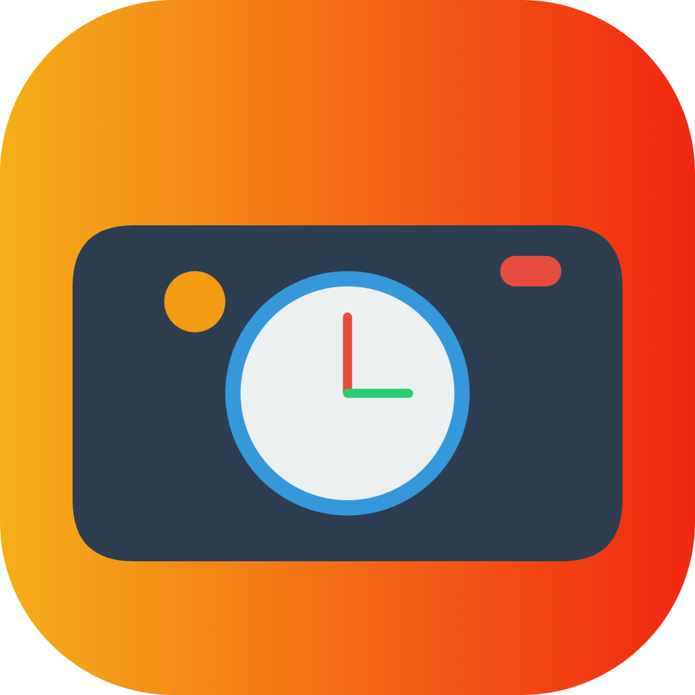

# TimeLens

[中文版本](README_ZH.md)

TimeLens combines the Pomodoro technique with AI analysis to help you understand and improve your work habits, achieving true, efficient focus.

## Features

### 🍅 Smart Pomodoro
Customize focus times, flexibly arrange your work rhythm.

### 🤖 AI Insights
Assess real focus through AI analysis of screen content.

### 📊 Detailed Statistics
Visualize your work patterns to help you continuously improve.

## How It Works

1. **Set Pomodoro Timer**: Choose your focus duration
2. **Smart Screenshots**: Automatically capture screen content during focus sessions
3. **AI Analysis**: Evaluate your focus level and work content

## Installation

### Mac
- Download the latest version for Mac [here](https://timelens.suinian.ai/)
- Supports macOS 14 and above

### Windows
- Windows version is coming soon! [Join the waitlist](https://timelens.suinian.ai/)

## Support Us

### Buy Me a Coffee
Your support helps keep TimeLens running and improving. Every cup counts! [Buy me a coffee](https://buy.stripe.com/28o6oq1xz4AXeY04gi)

### Suggest a Feature
Have an idea to make TimeLens even better? We'd love to hear it! you can write down you suggest in the github isssue.

## Connect With Us

- [GitHub](https://github.com/suinian-ai/timelens)
- [Twitter](https://x.com/suinianai)
- [小红书](https://www.xiaohongshu.com/user/profile/62528d730000000010007c9e)
